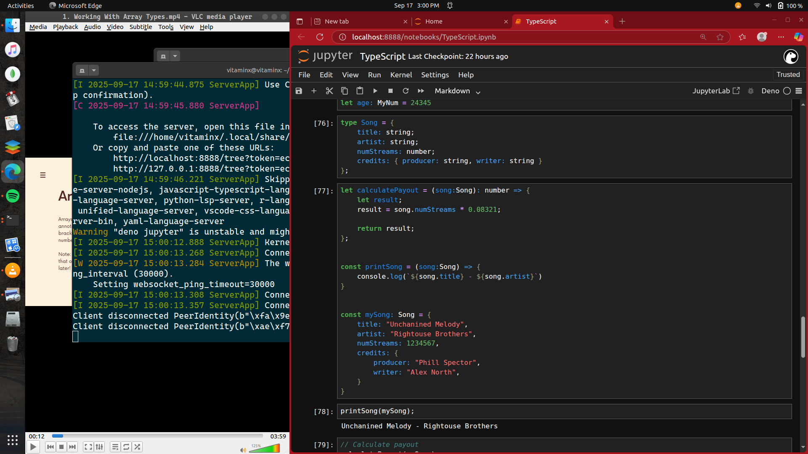

# Typescript Lectures 

### Installing Deno on Jupyter Notebook 



- Prerequisites: 

- - Ensure you have Python and pip installed on your system. 

- - Install Jupyter Notebook 

```bash 
   $ pip install jupyterlab 
   $ pip install jupyter 

```

### Steps to Install Deno

- Install Deno: Use one of the following commands based on your operating system:

### MacOS / Linux:

<p> You can visit the webstite here: <br> 

<a href="https://docs.deno.com/runtime/reference/cli/jupyter/" > Deno Website </a>

</p>

```bash 

curl -fsSL https://deno.land/x/install/install.sh | sh

```

<p>
This command installs the Deno kernel for Jupyter.
Using Deno in Jupyter Notebook
Launch Jupyter Notebook or JupyterLab.
When creating a new notebook, select the Deno kernel from the kernel options.
Running Code
You can now write and execute TypeScript or JavaScript code directly in your Jupyter Notebook cells.

</p> 
